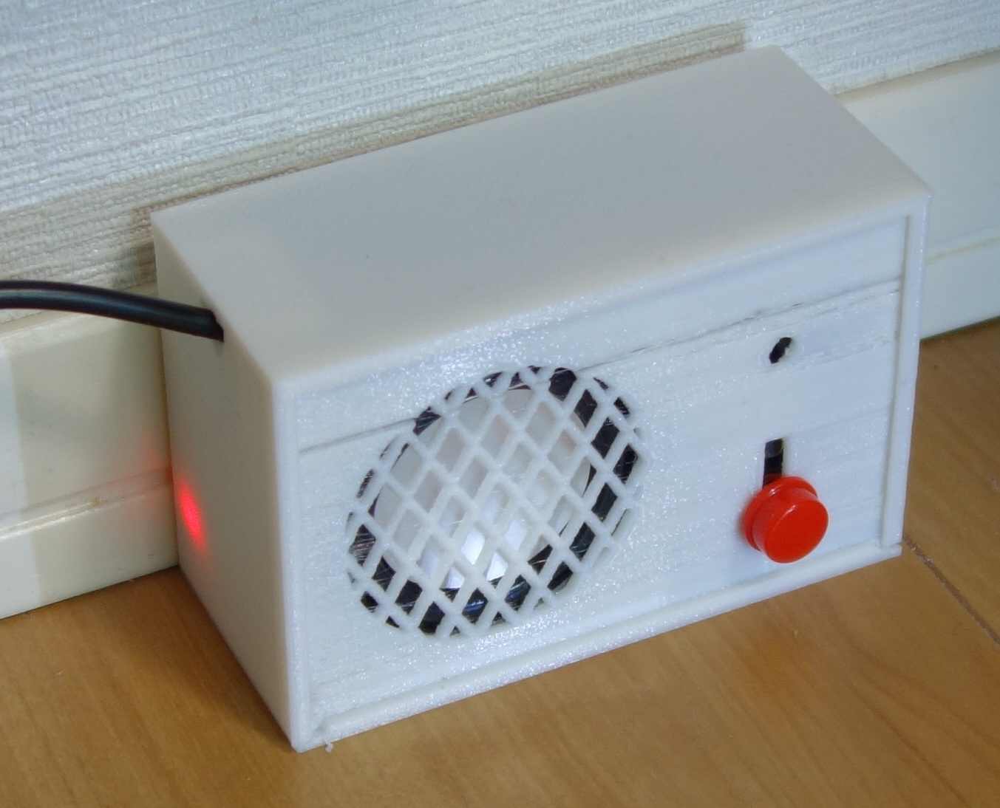
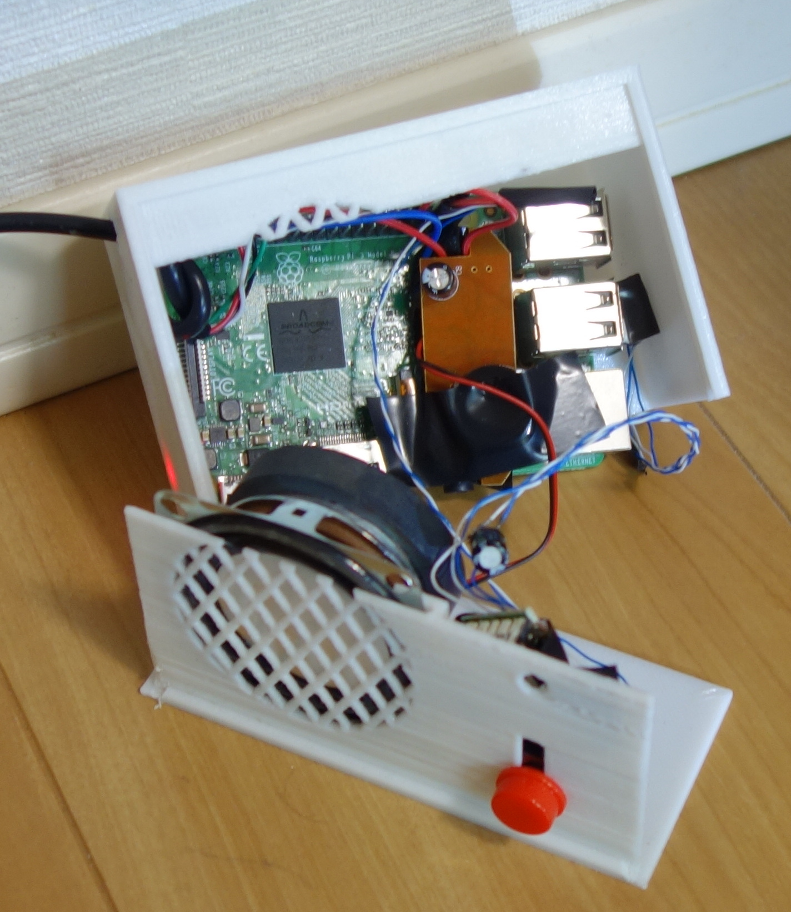
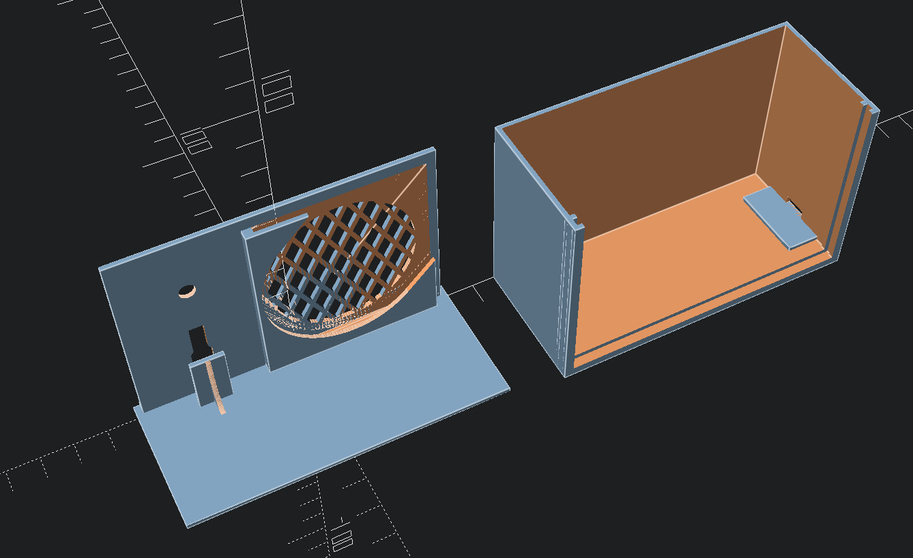

## Prototype 2022-02-19

I built a prototype device to get a feel for how actually having / using the device would feel.

This clearly revealed several flaws:

 * Too many custom parts make for crazy complexity:  
   It's essentially built from whatever scrap I had lying around - the exact same device is probably not reproducible.
 * Too much soldering:  
   The case fits the Raspberry Pi 3b quite snugly.
   Thus, I can't use the audio jack or USB sockets normally.
   The audio jack can be remapped to header pins with `dtoverlay=audremap,pins_12_13`,
   but for the microphone, I made a custom, extremely flat L-shaped USB plug.
   Blch.

   The next version will have a hole in the case so the microphone can be plugged into the USB sockets directly.
 * I originally tried to give it a nice MicroUSB plug for power supply -
   soldering wires to that to steal 5V turned out to be impossible for my shaky fingers.
   Instead, I just used a cheap USB/TTL cable, for the added benefit that I can debug boot/wifi connection problems without having to open the device.
 * Despite the [model](model.csg) being already optimized to be printable on my third-rate 3D printer,
   I'll still need to go simpler, since it still failed in several places:
   * The edges of the front wall that slides into the rest of the case develop bulge and become too thick -
     a rasp fixes that, but maybe I can make them triangular to prevent the problem.
   * Extruder trouble. :(
 * The 3D model had a slight flaw, where the frame surrounding the front was printed twice in once place.
   For the prototype, I corrected that with a knife.
 * The microphone quality is bad - really bad.
   Which I don't understand yet.
   The microphone works fine on my laptop.
 * The grid printed in front of the speaker touches the speaker and makes for a slightly clangy sound, even when playing clean audio files.

Despite all these flaws, it's fun to play with.
Now I definitely want two of these, so I can actually use them for communication.

Innards:

The front plate ripped because the extruder decided that it didn't wanna work, for a layer or two. It turns out that that's actually not much of a problem.

Model rendering:

The grid in front of the speaker is to make sure my printer doesn't choke on the overhang when finishing the large circle.
